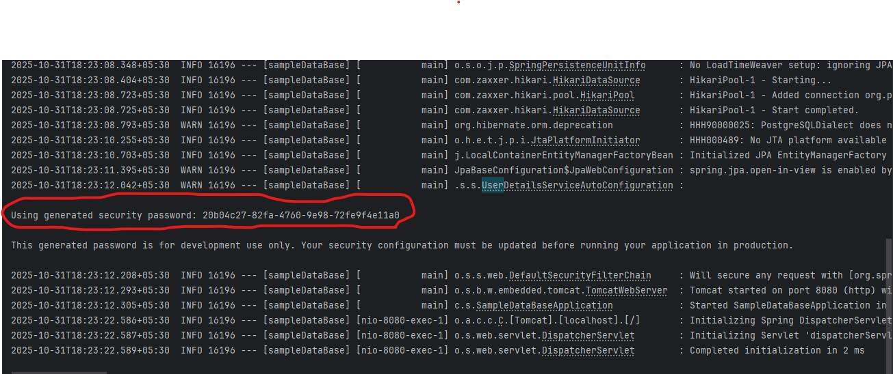
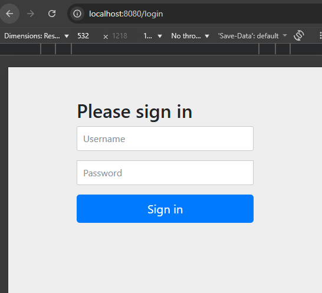
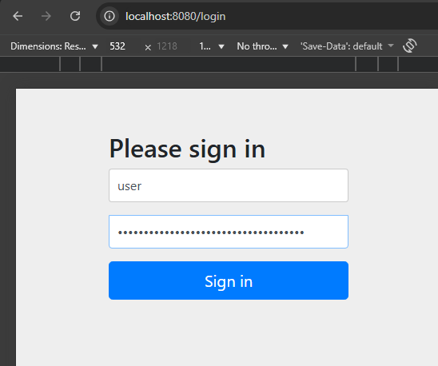
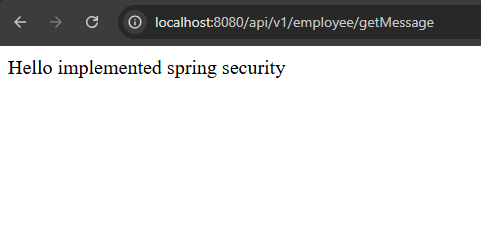

# SPRING SECURITY

## Pre-requesters
- Dependency
```bash
implementation "org.springframework.boot:spring-boot-starter-security"
```

Once installed happily start the application

## Usage

- Once dependency is installed start the application, you will get an Generated Password in you'r console like the below image.

> Note: Once you restart the application the password will be regenerated



- Now, create any endpoint like returning a basic string with hello world , like given below

```bash 
    @GetMapping("/getMessage")
    public String getHelloMessage(){
        return "Hello implemented spring security";
    }
```

## Accessing the above api on browser
After hitting the below URL on the browser we will be redirected to the below form login automatically with help of spring security
```bash
  http://localhost:8080/api/v1/employee/getMessage
```

### Redirect URl With Login Form



- Default Credentials

> UserName: user 
> Password : use the generated password as given in the console

- implementation





## Custom Username And Password

it can be achieved via using two simple properties like given below

```bash
spring.security.user.name = praveen
spring.security.user.password = praveen
```

